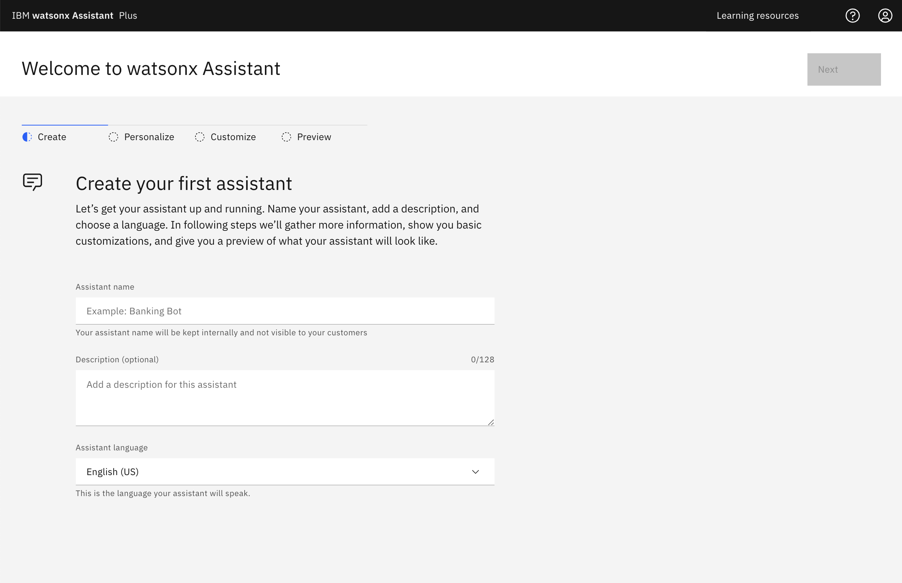

# Setup watsonx Environment

---

## Prerequisites

- Access to any **Watson Assistant instance** on a Lite, Plus Trial, Plus, or Enterprise plan
- Access to an instance of **Watson Discovery**
- Access to the **watsonx platform**
- Access to an instance of **Watson Machine Learning**

---

## Step-by-step Instructions

### 1. Create a new Watson Assistant

Create your first assistant in the Watson Assistant platform. The starter page will look like the following -

### 2. Setup Watson Discovery

1.  Under new projects, input a detailed project name. Select the option **"Conversational Search"** then click Next.
    
2.  Input a collection name.
3.  Upload the file that will serve as the knowledge base. It should look like the following once you have uploaded -
    
4.  In the Upload data section, select the _here_ hyperlink at the end of "Need to connect to a data source? Click here"
    1. **OPTION 1 - Web Crawl**
       1. Click "Web Crawl" then click Next
       2. Input starting URL then click "Add" to add and repeat for all the domains.
       3. Navigate to the upper-left hamburger icon, then go to Manage Collections, then New collections.
       4. Select a data source.
       5. If utilizing a webcrawl, input the url links to "Starting URLs" and click "Add" then Finish.
    2. **OPTION 2 - Cloud Object Storage**
       - To access files such as PDFs, CSVs, or HTML through Cloud Object Storage (COS) requires **COS Configuration** and setting up Watson Discovery accordingly.

### 3. Setup watsonx

In the [watsonx platform](https://dataplatform.cloud.ibm.com/wx/home?context=wx), create a new Project. Once created, navigate to the Manage tab of this new project, and please keep note of the _Project ID_.
