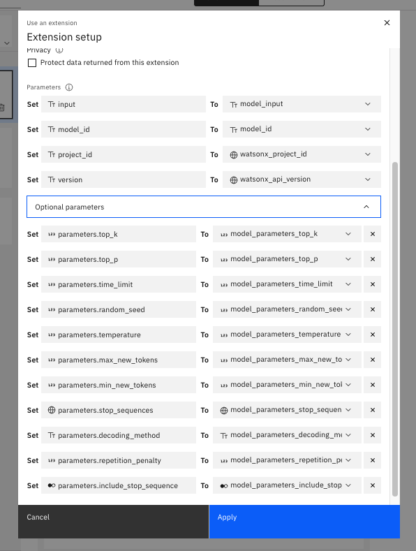

# watsonx Assistant Development

---

## Prerequisites

- a Watson Discovery Instance
- a watsonx.ai Instance

---

## Setup watsonx and Integrate with Watson Discovery

---

### Create Watson Discovery Custom Extension

1. If you do not have a watsonx Assistant yet, create an assistant and then complete the following steps.
2. Once created, in your assistant, navigate to the Integrations page.
3. Click "Build custom extensions" then click Next, then input the extension name "Watson Discovery" and click Next.
4. Download the Watson Discovery OpenAPI json file: [watson-discovery-query-openapi.json](https://github.com/watson-developer-cloud/assistant-toolkit/blob/master/integrations/extensions/starter-kits/watson-discovery/watson-discovery-query-openapi.json) and import this file to WA. This file contains the configuration to enable access to watson discovery from watsonx assistant.
5. Click Next, then click Finish.
6. In the lower-right corner of the Watson Disovery extension, click Add then click Next.
7. In Authentication page, in the Authentication type dropdown, select "Basic auth"
   1. For the _username_, enter "apikey".
   2. For the _password_, create and copy a new API key from [API key](https://cloud.ibm.com/iam/apikeys).
   3. For the _discovery_url_, within IBM Cloud, go to Resource List, then navigat to the Watson Discovery Instance, go to Manage, then go to Credentials, next click on URL.
   4. Paste the URL into discovery_url and remove "https://" from the beginning of the string
8. Click Next, then click Finish, then click Close.

---

### Create watsonx.ai Custom Extension

1. In your assistant, navigate to the Integrations page, click on "Build custom extension" then click Next and input the extension name "watsonx" then click Next.
   download json file: [watsonx-openapi.json](https://github.com/watson-developer-cloud/assistant-toolkit/blob/master/integrations/extensions/starter-kits/language-model-watsonx/watsonx-openapi.json) and import the file to WA.
2. Click Next, then click Finish.
3. In the lower-right corner of the watsonx extension, click Add, then click Add again, then click Next.
4. In the Authentication page, navigate to the Authentication type dropdown, then select "OAuth 2.0" within the options.
5. For the apikey, create and copy a new API key from [API key](https://cloud.ibm.com/iam/apikeys).
6. Click Next, then click Finish, then click Close.

---

### Integrate watsonx Search with Watson Discovery in Watson Assistant actions

1. Download [discovery-watsonx-actions.json](https://github.com/watson-developer-cloud/assistant-toolkit/blob/master/integrations/extensions/starter-kits/language-model-conversational-search/discovery-watsonx-actions.json). This json files contain three actions that link the Watson Discovery extension and the watsonx.ai extension to work together.
2. Within watsonx Assistant, navigate to the Actions page, then click the Global Settings icon on the upper-right corner.
3. Navigate to the Upload/Download tab, then upload the JSON file discovery-watsonx-actions.json that you downloaded earlier onto the tab or click to select a file from your local system. Click Upload, and then click **Upload and Replace**. Now the 3 actions are imported into this Watsonx Assistant.
4. Within the Actions page, navigate to the "Actions / Variables / Created by you" section and set the **discovery_project_id** and **watsonx_project_id** session variables to new values.
   - **Where to get the credentials**
     - **discovery_project_id:** within Watson Discovery: Go to the project that you created, then navigate to the upper-left hamburger icon, click on the Integrate and deploy tab and then go to API Information. Copy the Project ID and navigate back to watsonx assistant to paste it in the Initial value box of this Session variable.
     - **watsonx_project_id**:
       - Go to the watsonX Platform.
       - If you do not have an project, create a new project.
       - **Check Services & integrations:** Within the project, navigate to Manage, then to Services & Integrations. If no services is associated, click Associate Service, select Watson Machine Learning, click Associate.
       - Once you confirm WML is associated, Navigate to Manage, then General, then Details, and copy the Project ID. Navigate back to watsonx assistant to paste it in the Initial value of this Session variable.

---

### Configure watsonx Assistant with Additional Actions

1. On the Actions page of watsonx Assistant, click on Global Settings.
2. On the Upload/Download tab, click the Upload button and upload the file that was given to you by your IBM instructors.
3. You will see the following after you've imported the json file to you Watsonx Assistant
   
4. Configure **search** action
5. Configure the **watsonx generation API action**
   1. In the **watsonx generation API action**, for Step 1 under "Use an extension" click on _watsonx.ai Custom Extension_ then set each parameter variable to itself, like the following:
      
   2. For Step 2, check to make sure if the call to watsonx.ai was successful by setting the **conditions** and **variable values** to the following image:
      
   3. For Step 3, set the variable **model_response** to null in the case that the call to watsonx.ai was not successful.

---

### Final Check

Once the **watsonx Assistant development** is fully complete, you should see the status of actions showing green checkmarks, similar to screenshot below.

