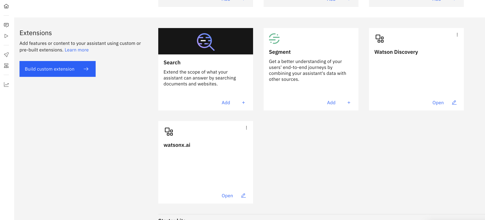
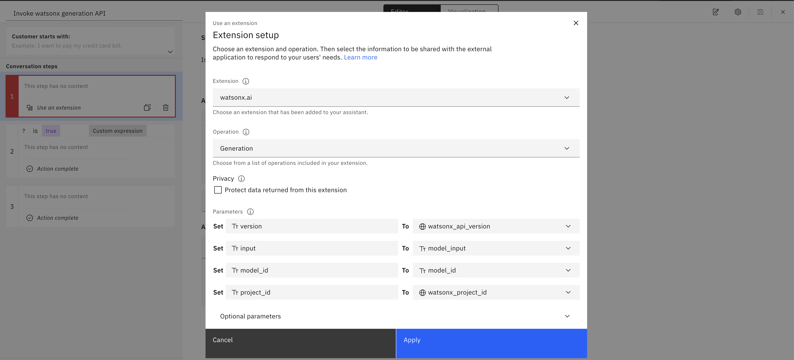

# watsonx Assistant Development

---

## Prerequisites

- a Watson Discovery Instance
- a watsonx.ai Instance

---

## Setup watsonx and Integrate with Watson Discovery

### Create Watson Discovery Custom Extension

1. If you do not have an Watsonx Assistant, create new bot and fill in all required information.
1. Once created, in your assistant, navigate to "Integrations" page.
1. Click "Build custom extensions" -> click "Next" -> Input Extension name `Watson Discovery` -> click "Next"
1. Download the Watson Discovery OpenAPI json file: [watson-discovery-query-openapi.json](https://github.com/watson-developer-cloud/assistant-toolkit/blob/master/integrations/extensions/starter-kits/watson-discovery/watson-discovery-query-openapi.json) and import file to WA. This file contains the configuration to enable accessing to watson discovery from watsonx assistant.
1. click "Next" -> click "Finish"
1. Lower Right corner of the Watson Disovery extension, click "Add" -> click "Add" -> click "Next"
   
1. In Authentication page, in the Authentication type dropdown, select "Basic auth"
   1. For Username enter `apikey`
   1. For password and discovery_url, within IBM Cloud -> resource list -> click on you Watson Discovery Instance
   1. You'd see the following view.
      1. Copy **API Key** and paste it in _Password_ field.
      1. Copy **URL** and paste it in _discovery_url_ and remove `https://` from the beginning of the string
         
1. Click "Next", click "Finish", click "Close"

---

### Create watsonx.ai Custom Extension

1.  In your assistant, navigate to Integrations page, click "Build custom extension" -> click "Next" -> Input Extension name `watsonx.ai` -> click "Next" .
1.  download json file: [watsonx-openapi.json](https://github.com/watson-developer-cloud/assistant-toolkit/blob/master/integrations/extensions/starter-kits/language-model-watsonx/watsonx-openapi.json) and import file to WA
1.  click "Next" -> click "Finish"
1.  Lower Right corner of the watsonx extension, click "Add" -> click "Add" -> click "Next"
1.  In Authentication page, in the Authentication type dropdown, select "OAuth 2.0"
    1. For Apikey, create and copy a new API key from [API key](https://cloud.ibm.com/iam/apikeys)
    1. For Server variables, select the region that matches where your environment is configured in.
1.  Click "Next", click "Finish", click "Close"
1.  Your Extensions section will appear as following screenshot once both Watson Discovery and watsonx.ai custom extensions were configured.  
    

---

### Configure watsonx Assistant action to integrate watsonx.ai and Watson Discovery for conversational search

##### Upload Actions:

1. On the Actions page of watsonx Assistant, click on Global Settings.
2. On the Upload/Download tab, click the Upload button and upload the file that was given to you by your IBM instructors.
3. You will see the following after you've imported the json file to you Watsonx Assistant
   
4. Configure the "Invoke watsonx generation API" action
   1. On Step 1, click "Edit extension" to setup watsonx.ai custom extension.
      
   2. For the Extension options, select "watsonx.ai" and for the Operation options, select "Generation"
   3. For "Parameters"
      1. set **version** to `watsonx_api_version` variable
      2. set **input** to `model_input` variable
      3. set **model_id** to `model_id` variable
      4. set **project_id** to `watsonx_project_id` variable
         
   4. Click "Apply", and click "Save".

##### Update session variables:

1. within the Actions page, navigate to "Actions / Variables / Created by you".
   
1. Set `discovery_project_id` and `watsonx_project_id` session variable
   :::info
   **Where to get credentials**
   - **discovery_project_id**: within Watson Discovery: Upper left Hamburger icon -> Integrate and deploy -> API Information. Copy Project ID and navigate back to watsonx assistant to paste it in the `Initial value` box of this Session variable.
   - **watsonx_project_id**: - Go to [watsonx Platform](https://dataplatform.cloud.ibm.com/wx/home?context=wx) - If you do not have an project, create a new project. - **Check Services & integrations**: Within the project, navigate to Manage -> Services & Integrations. If no services is associated, click "Associate Service" -> select "Watson Machine Learning" -> click "Associate". - Once you confirm WML is associated, Navigate to Manage -> General -> Details -> Project ID. Copy Project ID and navigate back to watsonx assistant to paste it in the `Initial value` of this Session variable.
     :::
1. Once you've finished configuring the variables, click "Preview" on the lower right corner, and type in questions to test the Conversational Search in your assistant!
   

---

### Final Check

Once the **watsonx Assistant development** is fully complete, you should see the status of actions showing green checkmarks, similar to screenshot below.

