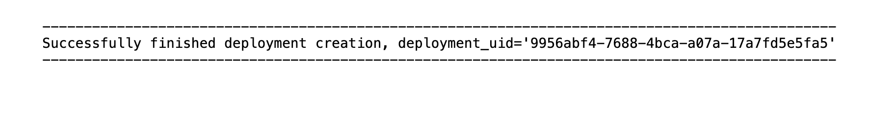
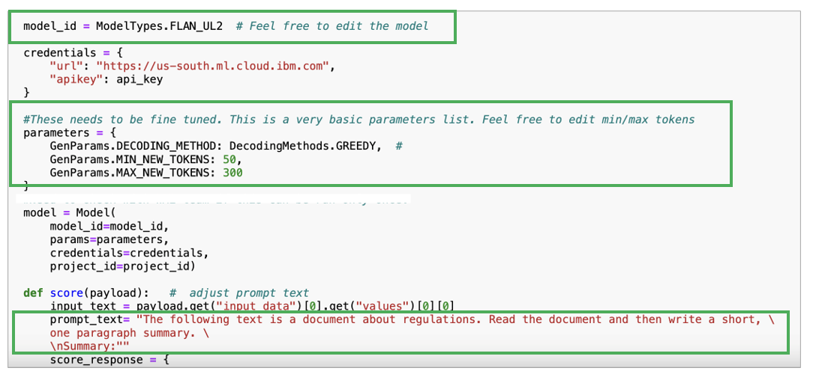

# watsonx.ai Models Development

## Prerequisite

- A OpenPages instance
- Watsonx.ai Instance
- Watson Machine Learning Instance

## Develop Watsonx.ai Model

### 5W's Model

- Before running the 5 W's notebook (under the Assets folder), you will need three pieces of information:
  1. [IBM Cloud API key (Generate here)](https://cloud.ibm.com/iam/apikeys) for the environment/account in which you're working (sometimes users are working in more than one environment; you need a key for the cloud account where you're working on this project)
  2. watsonx.ai Project ID - You will have to create a project in the WatsonX Instance (find the project ID under Your Project -> Manage -> General)
  3. A Deployment Space GUID - You will have to create a deployment space in the WatsonX Instance (find the Deployment Space ID under Deployments -> Your Deployment -> Manage -> General)
- In the first cell of the 5 W's notebook, input the watsonx.ai Project ID and Deployment Space ID (instructions are in the notebook)
- When you run the first code block, you will be prompted for your Cloud API key
- The second code block in the notebook calls the LLM model and sets up Watson Machine Learning. You will want to modify the name of the first inner function to your model name. You can edit the LLM model, parameters, and the prompt to fit your use case as well.
- You will want to change the prompt function name in the fourth cell. Note the deployment ID in the output of the fourth cell to deploy the model to Open Pages later.
  
- You can verify the function was succesfully deployed by going to Deployments -> Your Deployment ->Assets
  

### Summarization Model

- In order to run the Summarization notebook (under Assets), you will need three pieces of information: 1. [IBM Cloud API key (Generate here)](https://cloud.ibm.com/iam/apikeys) for the environment in which you're working (sometimes users are working in more than one env; you need a key for the env where you're working on this project) 1. watsonx.ai Project ID 1. a Deployment Space ID
  

- In the Summarization notebook > input the watsonx.ai Project ID and Deployment Space ID into the first code block (instructions are in the notebook)
- When you run the first code block, you will be prompted for your Cloud API key
- The second code block in the notebook calls the LLM model and sets up Watson Machine Learning; there are only two pieces of information you may want to edit in this code block > the LLM model and the prompt; the current LLM model was chosen due to its success rate and accuracy in outputing a summary that contains key data points, including quantitative data. You are free to experiment with models and prompts.
  

Once you are satisfied with your model and prompt, continue to the next section ## Deploy Watsonx.ai Model to Deployment Space

## Deploy Watsonx.ai Model to Deployment Space

In the Summarization notebook:

- Run code block #3 without making any changes
- When you run code block #4, the output will contain a Deployment ID; _copy this Deployment ID and paste it into your instance of Open Pages_; this will allow you to summarize content contained in your Open Pages instance
  

## Integrate watsonx.ai Model to OpenPages

### OpenPages Configuration

1. Click Administration menu > Integrations > Custom Machine Learning Models
1. Click New Model and you'll see the following view.
   

#### Model Access

1. Enter "Name" and "Label"
1. Select "Watson Machine Learning on Cloud" for Watson Service Type
1. Select "Display only" if we want to display output from running the model.
1. For Access Parameters:
   1. Authentication URL: `https://iam.cloud.ibm.com/identity/token`
   1. API Key: Create a IAM Key from the cloud account where the deployment lives (https://cloud.ibm.com/iam/apikeys)
   1. Base Deployment URL: `https://us-south.ml.cloud.ibm.com/ml/v4`
   1. Deployment id: _Deployment ID copied from the jupyter notebook_
   1. Space id: _Deployment Space ID_
   1. API version: `2021-05-01`
1. Click "Test Connection" to see if the setup was successful. Click "Next"
   

#### Inputs

1. In "Object Type", select the object type that you'd lilke this model to be applied to from the dropdown list.
   
1. Select "Manual" or "Automatic" based on business requirements.
1. In "Add the input fields of your model and map them to fields in OpenPages.", select the fields that you'd like to use as input for the model to process. In our example, we'll be using Description field as input, so we select "Description" from the OpenPages fields and type in "Description" for the Model input fields.
1. Select checkbox **Required** for at least one field.
1. The final setup would looks similar like screenshot below. Click "Next"
   

#### Outputs

1. Select "Single insight" or "List of insights" based on your use case.
1. In the **Output label** field, type in the text that you'd like to sshow to specify what's the model outpu is about.
1. In the **JSONada string** field, based on your model outpu configuration in the jupyter notebook, test how the model output and specify exactly which part of the output you'd like to display for each output field.
1. The final setup would looks similar like screenshot below. Click "Next"

- The Summarization example - `predictions.values[0][0]`
  
- The 5W's example - Who `predictions.values[0][0].$substringAfter("***Who: ***").$substringBefore("***What: ***")` - What `predictions.values[0][0].$substringAfter("***What: ***").$substringBefore("***When: ***")` - Where `predictions.values[0][0].$substringAfter("***Where: ***").$substringBefore("***Why: ***")` - When `predictions.values[0][0].$substringAfter("***When: ***").$substringBefore("***Where: ***")` - Why `predictions.values[0][0].$substringAfter("***When: ***").$substringBefore("***Where: ***")`
  
  

#### Guidance

1. Input the Description of the model to help users understand what the model input and output. You could also modify the Style.
1. The final setup would looks similar like screenshot below. Click "Save" to complete model setup. In the Custom Machine Learning Models table, you should see status "V Complete".
   

## Assign Watsonx.ai model to OpenPages View

1. To assign model to views, click _Administration menu > Solution Configuration > Views_.
   
1. Search for the View that you'd like to edit.
1. Another way to access the view that you'd like to modify is through enabling **"Display Debug Info"**. Click _Administration menu > Other > Display Debug Info_. In the screenshot example, Now you could see blue texts under "New Risk". Click on the blue text and it will link you to the exact view.
   
1. This is an example of what a view configuration page looks like.
   
1. Click on the blue text "Description" and a right-hand-side panel will show up. Select the specific model that you'd like to apply to this field. Click "Done". Click "Publish".
   

### Testing

1. Let's navigate back to the view where we've applied watsonx.ai model to. Input text to the Description field and a lightbult will show up.
1. Click on the lightbulb to open the right-hand side panel where the model output will show up.
1. In this example, we are applying "Tags". We can see that two different input show different tagging suggestions, indicating that the model is working.
1. You could continue update the model prompt to further improve the model performance based on your business requirements
   
   

## References

-
