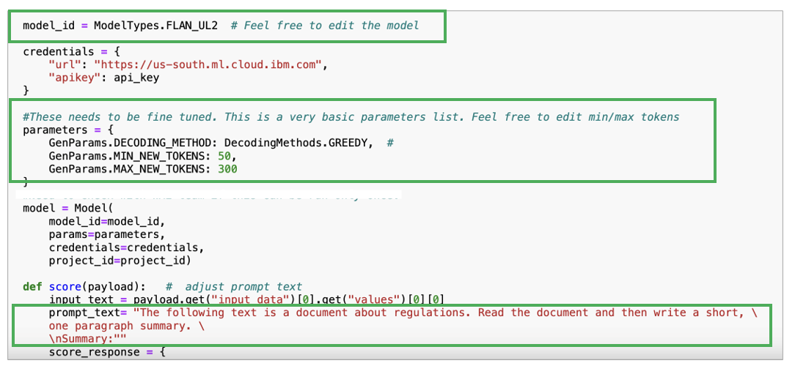
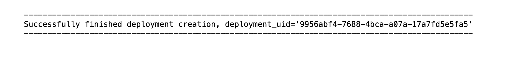
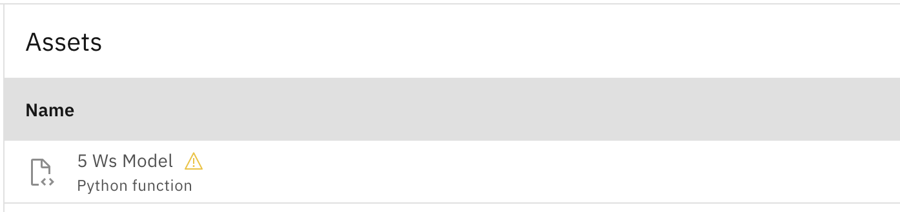
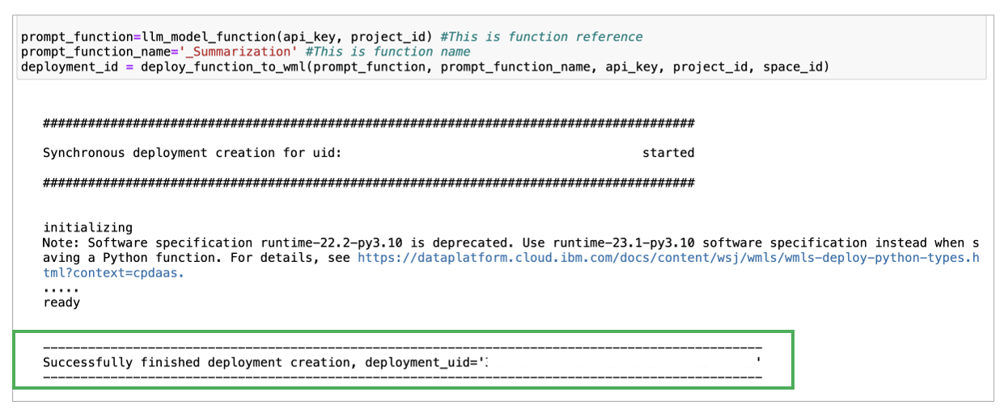

# watsonx.ai Models Development

---

## Prerequisites

- an OpenPages instance
- watsonx.ai Instance

---

## Setup the 5Ws Integration on OpenPages

To run the 5Ws notebook (given by IBM Instructor), you will need the following information:

1. **[IBM Cloud API key](https://cloud.ibm.com/iam/apikeys)** - found on IBM Cloud
2. **watsonx.ai Project ID** - found in your watsonx project, under the Manage header
3. **Deployment Space GUID** - found post deployment space creation in the watsonx platform

### Modifications to the Notebook

1. Input your **watsonx.ai Project ID** and your **Deployment Space GUID** in the 1st cell of the notebook.
2. Input your **API Key** once prompted after running the 1st code block.
3. For context, the 2nd code block in the notebook calls the LLM model and sets up Watson Machine Learning. Therefore, modify the name of the first inner function to your model name. You can edit the LLM model, parameters, and the prompt to fit your use case as well.
   
4. Change the prompt function name in the 4th cell. _Take note of the outputted Deployment ID from the 4th cell. This will be used to deploy the model to OpenPages later._
   
5. Verify if the function was succesfully deployed or not by going your Deployment, then Assets. If you see the following, then it was successfully deployed -
   

**Once you are satisfied with your model and prompt, continue to the next section.**

### Deploy the watsonx.ai Model to the Deployment Space

1. Still in the 5Ws notebook, run the 3rd code block without making any changes.
2. When you run the 4th code block, the output will contain a **Deployment ID**. _Be sure to copy this Deployment ID as you will use it later in OpenPages. It will allow you to extract the 5Ws from your content in your Open Pages instance._
   
