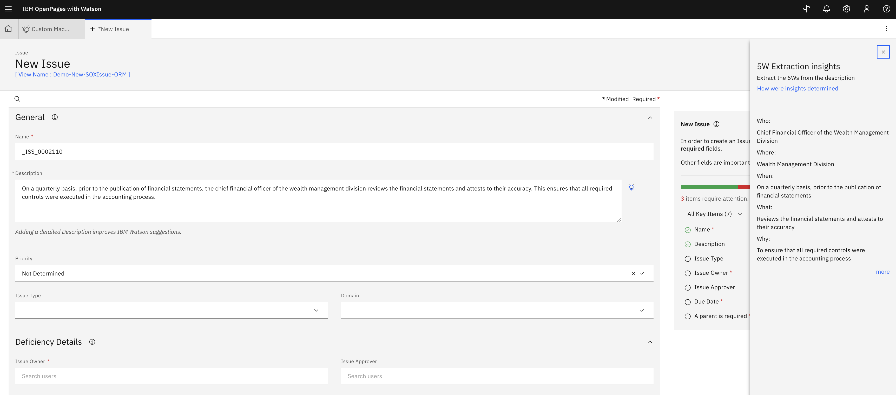

# watsonx.ai Models Development

---

## Prerequisites

- an OpenPages instance
- watsonx.ai Instance

---

## Setup the 5Ws Integration on OpenPages

To run the 5Ws notebook (given by IBM Instructor), you will need the following information:

1. **[IBM Cloud API key](https://cloud.ibm.com/iam/apikeys)** - found on IBM Cloud
2. **watsonx.ai Project ID** - found in your watsonx project, under the Manage header
3. **Deployment Space GUID** - found post deployment space creation in the watsonx platform

### Modifications to the Notebook

1. Input your **watsonx.ai Project ID** and your **Deployment Space GUID** in the 1st cell of the notebook.
2. Input your **API Key** once prompted after running the 1st code block.
3. For context, the 2nd code block in the notebook calls the LLM model and sets up Watson Machine Learning. Therefore, modify the name of the first inner function to your model name. You can edit the LLM model, parameters, and the prompt to fit your use case as well.
   
4. Change the prompt function name in the 4th cell. _Take note of the outputted Deployment ID from the 4th cell. This will be used to deploy the model to OpenPages later._
   
5. Verify if the function was succesfully deployed or not by going your Deployment, then Assets. If you see the following, then it was successfully deployed -
   

**Once you are satisfied with your model and prompt, continue to the next section.**

### Deploy the watsonx.ai Model to the Deployment Space

1. Still in the 5Ws notebook, run the 3rd code block without making any changes.
2. When you run the 4th code block, the output will contain a **Deployment ID**. _Be sure to copy this Deployment ID as you will use it later in OpenPages. It will allow you to extract the 5Ws from your content in your Open Pages instance._
   

---

## Integrate the watsonx.ai Model into OpenPages

1. In the OpenPages platform, navigate to the Administration menu, then go to Integrations, then Custom Machine Learning Models.
2. Click on New Model and you should see the following view -
   

### Model Access

1. Enter a Name and a Label as **"5Ws Extraction"**
2. Select **"Watson Machine Learning on Cloud"** for Watson Service Type
3. Select **"Display only"** since we only want to display output from running the model
4. For Access Parameters:
   1. Authentication URL: paste in the following `https://iam.cloud.ibm.com/identity/token`
   2. API Key: Create a IAM Key in the cloud account where the deployment lives (https://cloud.ibm.com/iam/apikeys)
   3. Base Deployment URL: paste in the following `https://us-south.ml.cloud.ibm.com/ml/v4`
   4. Deployment ID: this should be the **Deployment ID** copied from the jupyter notebook
   5. Space ID: _Deployment Space ID_
   6. API version: `2021-05-01`
5. Click **Test Connection** to see if the setup was successful. Then, Click Next. Your screen should look similar to the following -
   

### Inputs

1. For **Object Type**, select the OpenPages object type that you would like this model to be applied to from the options in the dropdown list.
   
2. Select "Manual" or "Automatic" based on business requirements.
3. In **Add the input fields of your model and map them to fields in OpenPages**, select the fields that you would like to use as the input for the model to process. _In our example, we will be using Description field as the input, so we select "Description" from the OpenPages fields and type in "Description" for the Model input fields._
4. Select checkbox **Required** for at least one field.
5. The final setup should look similar to the following. Then, click Next.
   

### Outputs

1. Select "Single insight" or "List of insights" based on your use case.
2. In the **Output label** field, input a description of what the model output is about.
3. In the **JSONata string** field, based on your model output configuration in the Jupyter Notebook, specify the variable to display in the output field.
4. The final setup should look like the following, then click Next.

- For the Summarization example - use the variable `predictions.values[0][0]`
  
- For the 5Ws example -
  - Who `predictions.values[0][0].$substringAfter("Who: ").$substringBefore("What:")`
  - What `predictions.values[0][0].$substringAfter("What: ").$substringBefore("When:")`
  - Where `predictions.values[0][0].$substringAfter("Where: ").$substringBefore("Why:")`
  - When `predictions.values[0][0].$substringAfter("When: ").$substringBefore("Where:")`
  - Why `predictions.values[0][0].$substringAfter("Why: ")`
    
    

### Guidance

1. Input a **Description** for the model to help users understand what the model inputs and outputs. You could also modify the **Style.**
2. The final setup would looks similar like screenshot below. Click "Save" to complete model setup. In the Custom Machine Learning Models table, you should see status "V Complete".
   

---

## Assign Watsonx.ai model to OpenPages View

1. To assign model to views, navigate to the **Administration menu**, then go to **Solution Configuration**, and click on **Views**.
   
2. Enable **Display Debug Info** by navigating to the Administration menu, then the Other tab, then click on Display Debug Info. In the screenshot below, you can see blue text under "New Risk" which indicates that you are in Debug Info View. **Click on the that blue text and it will link you to the exact view.**
   
3. This is an example of what a view configuration page looks like.
   
4. Click on the blue text "Description" and a right-hand-side panel will show up. Select the specific model that you would like to apply to this field. Click Done, then click Publish.
   

### Final Check

1. Navigate back to the view where the watsonx.ai model was applied. Input text to the Description field and a lightbulb should show up.
2. Click on the lightbulb to open the right-hand side panel where the model output will show up.
3. You could continue update the model prompt to further improve the model performance based on your business requirements
   
