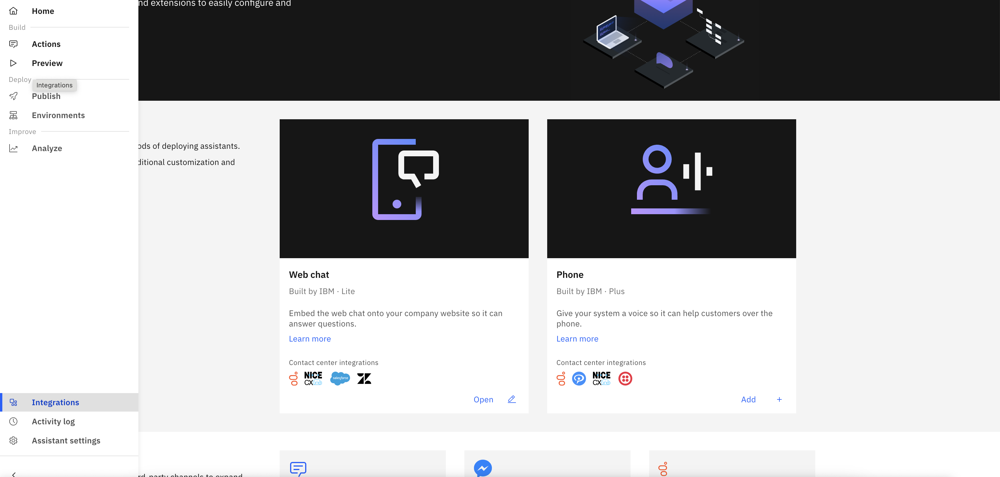
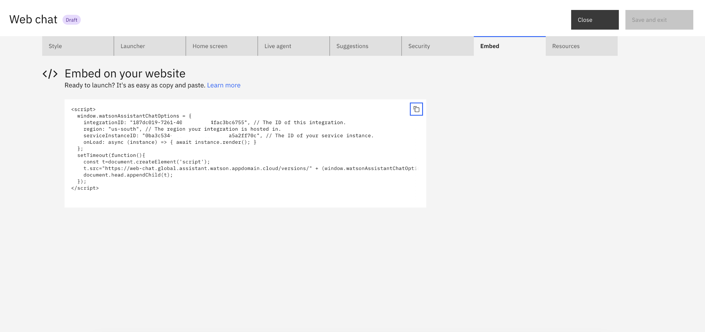

# Integrate watsonx Assistant into OpenPages

---

## Prerequisite

- A OpenPages instance
- A Watsonx Assistant instance
- A Watsonx.ai project
- A Watson Discovery instance

---

## Integrate watsonx Assistant with OpenPages

### In Watsonx Assistant

1. Navigate to Watsonx Assistant's **Integrations** Tab
   - 
1. Find "Web chat", click on "Open" -> choose environment, and "Confirm"
1. Navigate to Embed Tab and Copy the content in the text box. (This is an example)
   - 

### In OpenPages

1. Click Administration menu > Integrations > Watson Assistant.
1. Click Import Configuration (The button left of New +)
1. Paste the code snippet into the Configuration string box, and then click Import.
1. All good! You could now start interacting with your Watsonx Assistant in OpenPages.

## References

- [Configuring the integration between an assistant and OpenPages](https://www.ibm.com/docs/en/openpages/9.0.0?topic=assistant-configuring-integration-between-openpages)
