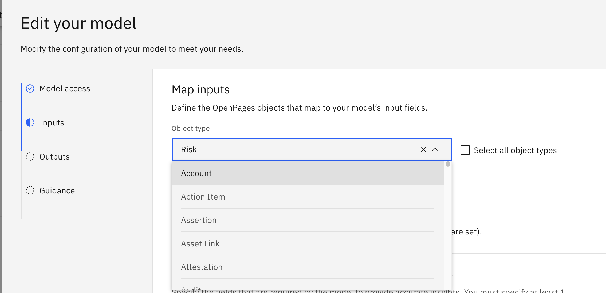
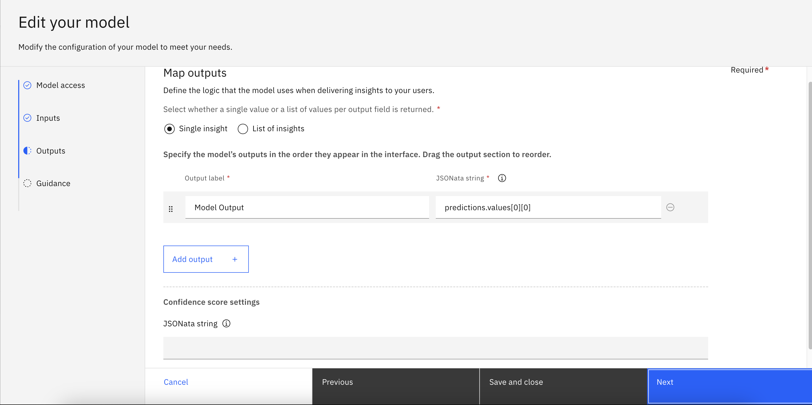
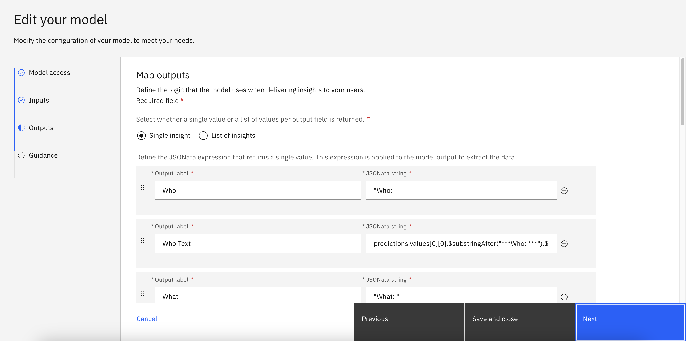
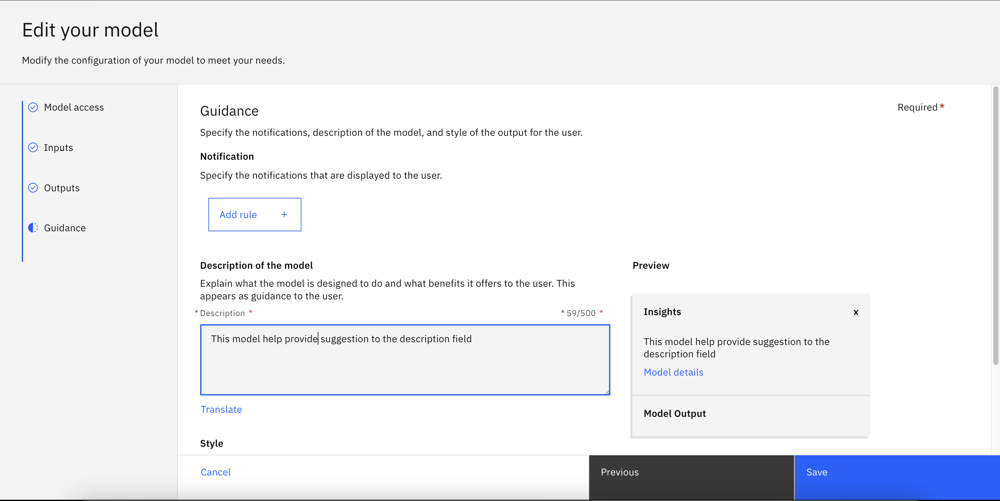
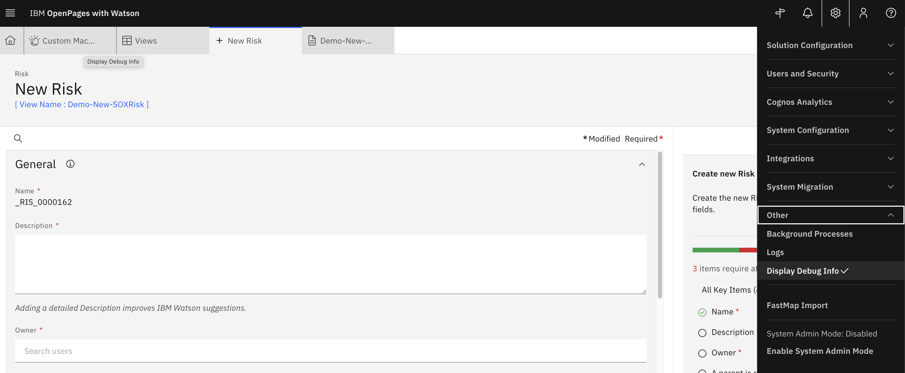
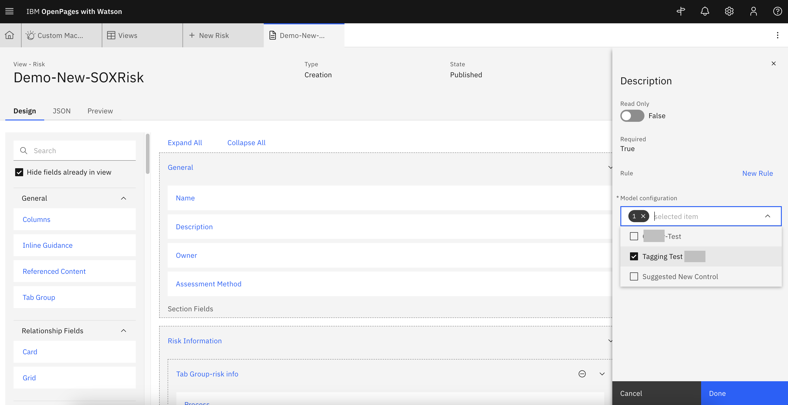
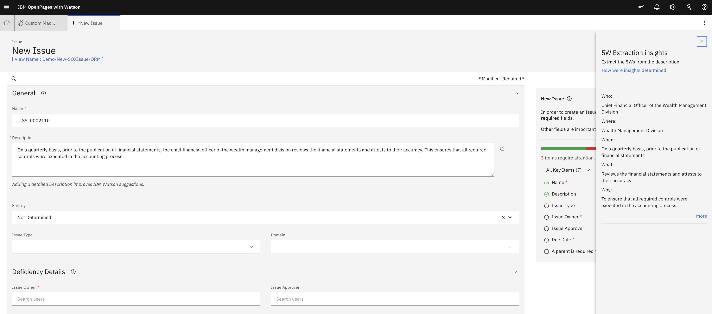

# Integrate watsonx Assistant into OpenPages

---

## Prerequisite

- A OpenPages instance
- A Watsonx Assistant instance
- A Watsonx.ai project
- A Watson Discovery instance

---

## Integrate the watsonx.ai Model into OpenPages

1. In the OpenPages platform, navigate to the Administration menu, then go to Integrations, then Custom Machine Learning Models.
2. Click on New Model and you should see the following view -
   

### Model Access

1. Enter a Name and a Label as **"5Ws Extraction"**
2. Select **"Watson Machine Learning on Cloud"** for Watson Service Type
3. Select **"Display only"** since we only want to display output from running the model
4. For Access Parameters:
   1. Authentication URL: paste in the following `https://iam.cloud.ibm.com/identity/token`
   2. API Key: Create a IAM Key in the cloud account where the deployment lives (https://cloud.ibm.com/iam/apikeys)
   3. Base Deployment URL: paste in the following `https://us-south.ml.cloud.ibm.com/ml/v4`
   4. Deployment ID: this should be the **Deployment ID** copied from the jupyter notebook
   5. Space ID: _Deployment Space ID_
   6. API version: `2021-05-01`
5. Click **Test Connection** to see if the setup was successful. Then, Click Next. Your screen should look similar to the following -
   

### Inputs

1. For **Object Type**, select the OpenPages object type that you would like this model to be applied to from the options in the dropdown list.
   
2. Select "Manual" or "Automatic" based on business requirements.
3. In **Add the input fields of your model and map them to fields in OpenPages**, select the fields that you would like to use as the input for the model to process. _In our example, we will be using Description field as the input, so we select "Description" from the OpenPages fields and type in "Description" for the Model input fields._
4. Select checkbox **Required** for at least one field.
5. The final setup should look similar to the following. Then, click Next.
   

### Outputs

1. Select "Single insight" or "List of insights" based on your use case.
2. In the **Output label** field, input a description of what the model output is about.
3. In the **JSONata string** field, based on your model output configuration in the Jupyter Notebook, specify the variable to display in the output field.
4. The final setup should look like the following, then click Next.

- For the Summarization example - use the variable `predictions.values[0][0]`
  
- For the 5Ws example -
  - Who `predictions.values[0][0].$substringAfter("Who: ").$substringBefore("What:")`
  - What `predictions.values[0][0].$substringAfter("What: ").$substringBefore("When:")`
  - Where `predictions.values[0][0].$substringAfter("Where: ").$substringBefore("Why:")`
  - When `predictions.values[0][0].$substringAfter("When: ").$substringBefore("Where:")`
  - Why `predictions.values[0][0].$substringAfter("Why: ")`
    
    

### Guidance

1. Input a **Description** for the model to help users understand what the model inputs and outputs. You could also modify the **Style.**
2. The final setup would looks similar like screenshot below. Click "Save" to complete model setup. In the Custom Machine Learning Models table, you should see status "V Complete".
   

---

## Assign Watsonx.ai model to OpenPages View

1. To assign model to views, navigate to the **Administration menu**, then go to **Solution Configuration**, and click on **Views**.
   
2. Enable **Display Debug Info** by navigating to the Administration menu, then the Other tab, then click on Display Debug Info. In the screenshot below, you can see blue text under "New Risk" which indicates that you are in Debug Info View. **Click on the that blue text and it will link you to the exact view.**
   
3. This is an example of what a view configuration page looks like.
   
4. Click on the blue text "Description" and a right-hand-side panel will show up. Select the specific model that you would like to apply to this field. Click Done, then click Publish.
   

### Final Check

1. Navigate back to the view where the watsonx.ai model was applied. Input text to the Description field and a lightbulb should show up.
2. Click on the lightbulb to open the right-hand side panel where the model output will show up.
3. You could continue update the model prompt to further improve the model performance based on your business requirements
   

---

## Integrate watsonx Assistant with OpenPages

### In Watsonx Assistant

1. Navigate to Watsonx Assistant's **Integrations** Tab
   - 
1. Find "Web chat", click on "Open" -> choose environment, and "Confirm"
1. Navigate to Embed Tab and Copy the content in the text box. (This is an example)
   - 

### In OpenPages

1. Click Administration menu > Integrations > Watson Assistant.
1. Click Import Configuration (The button left of New +)
1. Paste the code snippet into the Configuration string box, and then click Import.
1. All good! You could now start interacting with your Watsonx Assistant in OpenPages.

## References

- [Configuring the integration between an assistant and OpenPages](https://www.ibm.com/docs/en/openpages/9.0.0?topic=assistant-configuring-integration-between-openpages)
