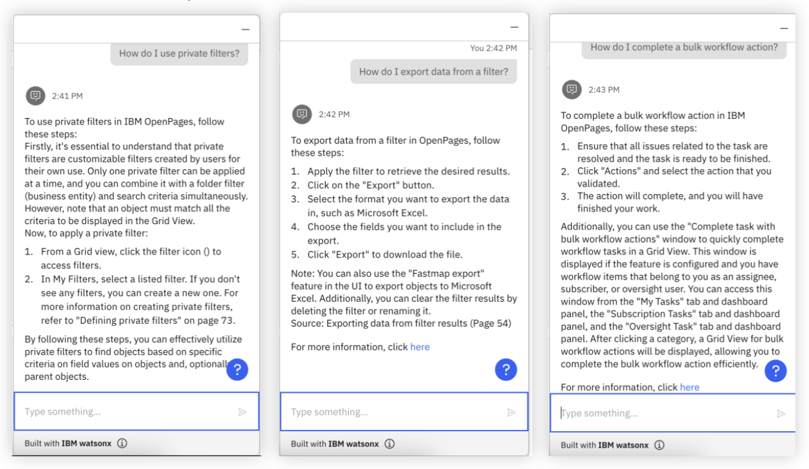

# AI Assisted Conversational Experience

**Background & challenges**: OpenPages users often struggle to determine how to execute a specific action within the tool, whether that be how to navigate to a specific page or the knowledge necessary to complete the action. Time is then spent searching through the user guide for answers, thus leading to frustration and decreased productivity.

**Proposed Solution**: To implement an integrated AI Assistant that allows users to pose questions in natural language and quickly retrieve answers on tool functionality, as well as guide the user directly to the correct page on OpenPages for specific questions regarding the interface.

---

Build a **personalized assistant that can converse with users in natural language with document search capability (RAG).** Incorporate Internal Audit methodologies and OpenPages user guide knowledge into OpenPages via watsonx Assistant. Oftentimes, businesses struggle with overburdening their call centers and/or training their chatbots with applicable information, this solution tackles both issues.

1. It answers questions more effectively, leading to less calls to your customer service agents.
2. Instead of manually programming FAQ, allow your chatbot to answer _any_ question using the power of generative AI.
3. Give your Assistant publicly existing information so that it can reference actual material for your users to check out.

---

## Conversational Search

Given what you already built in the **Prepare** and **Create** sections, your conversational assistant should already be up and running. At this point, your assistant should be referencing the documents that you uploaded into Watson Discovery and calling watsonx.ai when necessary for its conversational search capability. Some example prompts that you can use in order to test out its capabilities are the following -

1. How do I use private filters?
2. How do I export data from a filter?
3. How do I complete a bulk workflow action?

For all of these questions, it is clear that watsonx Assistant, Watson Discovery, and watsonx.ai provide a seamless integrated experience for users to get clear answers to their queries. **Please play around with this feature and try to ask it questions that specifically pertain to your use case at hand.**

---

# OpenPages Navigation with watsonx Assistant

Enable effective **OpenPages navigation with Embedded Links** in watsonx Assistant. This ensures that users are guided to the correct OpenPages location when users ask a question regarding a specific UI. This example will demonstrate the **Create a Risk action** that will lead a user to the Risk page in OpenPages. **Feel free to duplicate this action for your other embedded link areas.**

---

## Integrate Embedded links

1. Create a New action from scratch in watsonx Assistant under the Actions tab
2. Set examples of how users may prompt to create a Risk, such as "Create Risk" or "how can I create a risk" like the following image -
   
3. In the conversation steps, paste the following text in the "Assistant says" field. **Be sure to modify the right OpenPages link to make sure it routes the user to the right OpenPages instance.**
   - `You can create a Risk from  <a href="http://useast.services.cloud.techzone.ibm.com:XXXXX/openpages/app/jspview/react/grc/creation-view/SOXRisk?isSystemFile=false" target="blank">here</a>`
     
4. The integration is complete! Test out your action in Preview.

---

### If you would like to integrate additional embedded links, here are some other "Assistant says" examples:

- **Show risks:**
  `You can view your Risks from <a href="http://useast.services.cloud.techzone.ibm.com:XXXXX/openpages/app/jspview/react/grc/grid/SOXRisk" target="blank">here</a>`
- **Create a control:**
  `You can create a Control from  <a href="http://na4.services.cloud.techzone.ibm.com:XXXXX/openpages/app/jspview/react/grc/creation-view/SOXControl?isSystemFile=false">here</a>`
- **Show Controls:**
  `You can find a list of your controls from <a href="http://na4.services.cloud.techzone.ibm.com:XXXXX/openpages/app/jspview/react/grc/grid/SOXControl" target="blank">here</a>`
