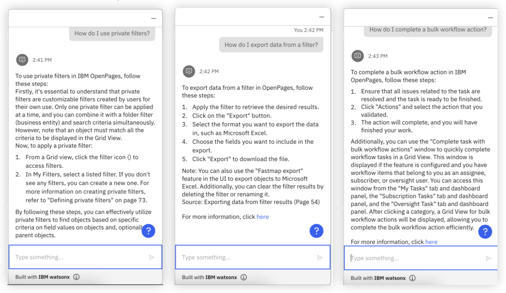

# Conversational Search in OpenPages

Build a **personalized assistant that can converse with users in natural language with document search capability (RAG).** Incorporate Internal Audit methodologies and OpenPages user guide knowledge into OpenPages via watsonx Assistant. Oftentimes businesses struggle with overburdening their call centers and/or training their chatbots with applicable information, this solution tackles both issues.

1. It answers questions more effectively, leading to less calls to your customer service agents.
2. Instead of manually programming FAQ, allow your chatbot to answer _any_ question using the power of generative AI.
3. Give your Assistant publicly existing information so that it can reference actual material for your users to check out.

---

## Implementation

Given what you already built in the **Prepare** and **Create** sections, your conversational assistant should already be up and running. At this point, your assistant should be referencing the documents that you uploaded into Watson Discovery and calling watsonx.ai when necessary for its conversational search capability. Some example prompts that you can use in order to test out its capabilities are the following -

1. How do I use private filters?
2. How do I export data from a filter?
3. How do I complete a bulk workflow action?

For all of these questions, it is clear that watsonx Assistant, Watson Discovery, and watsonx.ai provide a seamless integrated experience for users to get clear answers to their queries. **Please play around with this feature and try to ask it questions that specifically pertain to your use case at hand.**
