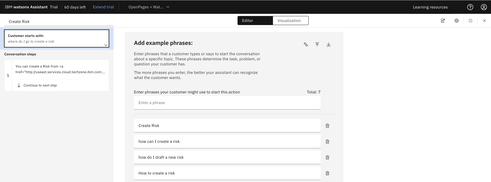
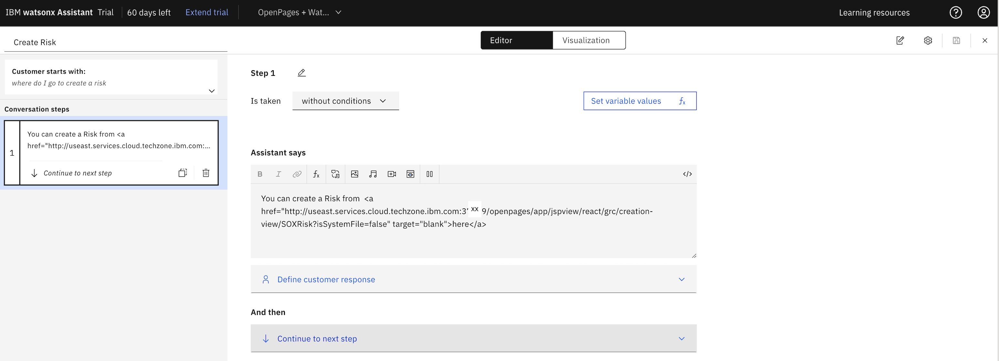

# OpenPages Navigation with watsonx Assistant

Enable effective **OpenPages navigation with Embedded Links** in watsonx Assistant. This ensures that users are guided to the correct OpenPages location when users ask a question regarding a specific UI. This example will demonstrate the **Create a Risk action** that will lead a user to the Risk page in OpenPages. **Feel free to duplicate this action for your other embedded link areas.**

---

## Integrate Embedded links

1. Create a New action from scratch in watsonx Assistant under the Actions tab
2. Set examples of how users may prompt to create a Risk, such as "Create Risk" or "how can I create a risk" like the following image -
   
3. In the conversation steps, paste the following text in the "Assistant says" field. **Be sure to modify the right OpenPages link to make sure it routes the user to the right OpenPages instance.**
   - `You can create a Risk from  <a href="http://useast.services.cloud.techzone.ibm.com:XXXXX/openpages/app/jspview/react/grc/creation-view/SOXRisk?isSystemFile=false" target="blank">here</a>`
     
4. The integration is complete! Test out your action in Preview.

---

### If you would like to integrate additional embedded links, here are some other "Assistant says" examples:

- **Show risks:**
  `You can view your Risks from <a href="http://useast.services.cloud.techzone.ibm.com:XXXXX/openpages/app/jspview/react/grc/grid/SOXRisk" target="blank">here</a>`
- **Create a control:**
  `You can create a Control from  <a href="http://na4.services.cloud.techzone.ibm.com:XXXXX/openpages/app/jspview/react/grc/creation-view/SOXControl?isSystemFile=false">here</a>`
- **Show Controls:**
  `You can find a list of your controls from <a href="http://na4.services.cloud.techzone.ibm.com:XXXXX/openpages/app/jspview/react/grc/grid/SOXControl" target="blank">here</a>`
