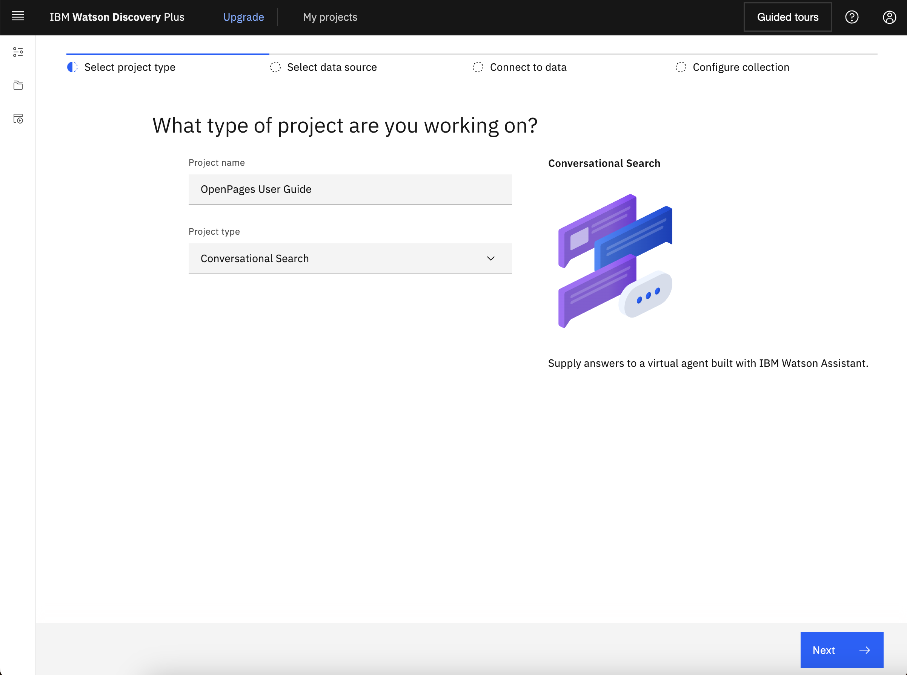
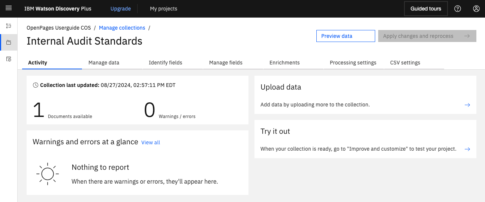
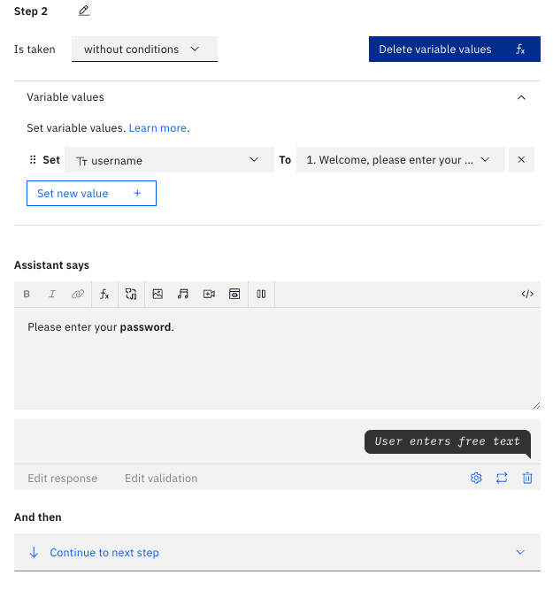
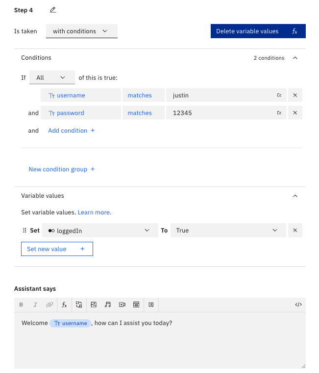
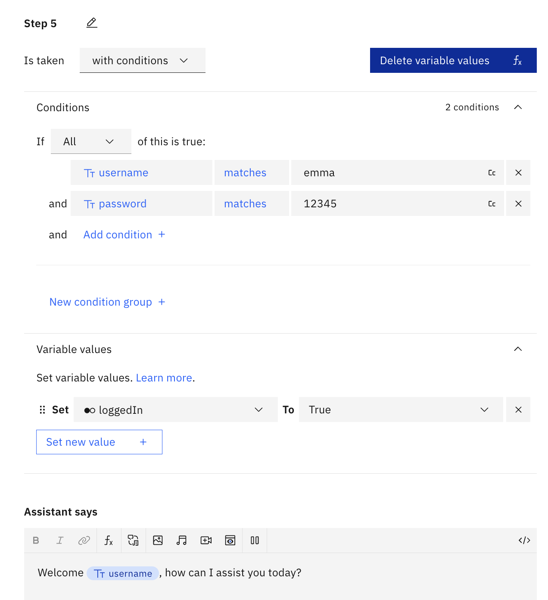
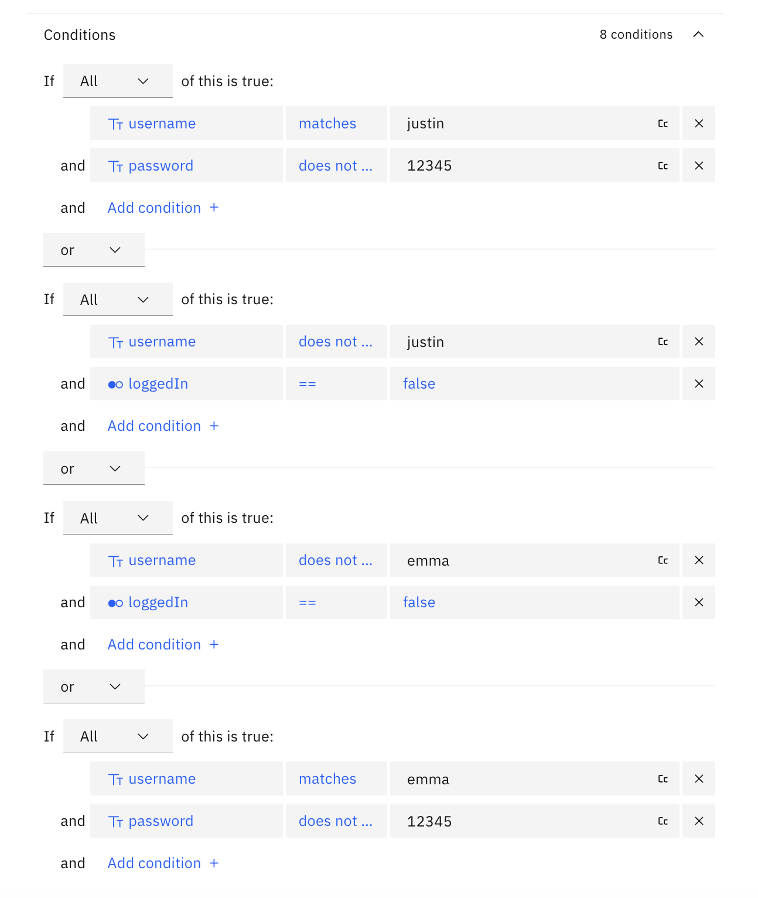
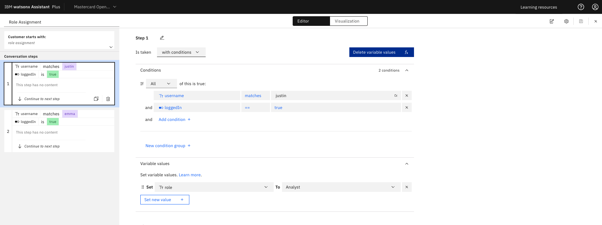
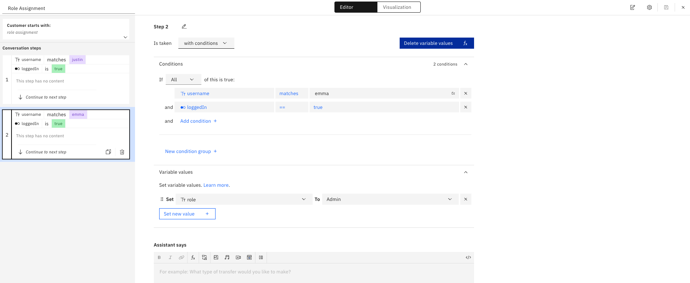

# Manage User Access in OpenPages

Ensure **role-based access control** to limit content and data exposure, along with creating rules to restrict users to specific modules. For this example, Justin will be in the Business Analyst role and Emma will be in the Admin Developer role. Therefore, Justin should not have access to the Admin User Guide.

---

## Upload the OpenPages Administrator Guide to Watson Discovery

1. Make sure that you have the OpenPages Administrator Guide downloaded locally.
2. Under new projects, input a detailed project name. Select the option **"Conversational Search"** then click Next.
   
3. Input a collection name.
4. Upload the file which will serve as the knowledge base. It should look like the following once you have uploaded -
   

---

## Create Login Action

1. In the watsonx Assistant platform, in the Actions tab, under Variables, under Created by you, create 3 new variables:
   - username: Create a new variable called username as type "Free Text" with no initial value. Then, click Save.
   - password: Create a new variable called password as type "Free Text" with no initial value. Then, click Save.
   - role: Create a new variable called role as type "Free Text" with no initial value. Then, click Save.
2. Under Actions, under All items, under Set by assistant, click on Greet Customer. Before anything, the user should be prompted to login to the system.
3. In the Greet Customer Action, delete all of the existing steps. Then, add on the following steps:
   1. **Step 1:** Type in "Welcome, please enter your username." under Assistant says, then set the output to _free text_.
   2. **Step 2:** Type in "Please enter your **password.**" under Assistant says, then set the output to _free text_. Also, set the variable value _username_ to Action step variable / Step 1. It should look similar to the following image:
      
   3. **Step 3:** Set the variable value _password_ to Action step variable / Step 2.
   4. **Step 4:** Type in "Welcome _username_, how can I assist you today?" under Assistant says. Set the conditions to, If all of this is true: username matches _justin_ and password matches _12345_ and set the variable values to loggedIn To True. It should look similar to the following image:
      
   5. **Step 5:** Type in "Welcome _username_, how can I assist you today?" under Assistant says. Set the conditions to, If all of this is true: username matches _emma_ and password matches _12345_ and set the variable values to loggedIn To True. It should look similar to the following image:
      
   6. **Step 6:** Type in "Your username or password is incorrect, please **try again.**" under Assistant says, and set the And then section to Re-ask previous step(s) and set to Steps 1-5. Set the conditions to the following image:
      
   7. **Step 7:** Set the And then section to Go to subaction: goes to action "Role assignment" so that they can re-login.
4. Now, when the Assistant first prompts the user, it should ask them to login. **Test out your new action sequence in Preview!**

---

## Role Assignment

1. Next, navigate to the Actions tab, under All items, under Created by you, create a New action called "Role Assignment" from scratch.
2. Add a New step, and for Step 1, click on Is taken "with conditions" then please complete the following:
   - Under conditions, set If All of this is true: username matches justin and loggedIn == true
   - Under Variable values, please set the variable value role to Analyst
     
3. Add another step, and for Step 2, click on Is taken "with conditions" then please complete the following:
   - Under conditions, set If All of this is true: username matches emma and loggedIn == true
   - Under Variable values, please set the variable value role to Admin
     
4. Be sure to save this action, then close out of this window. Preview your new action in the bottom-right Preview chat.
