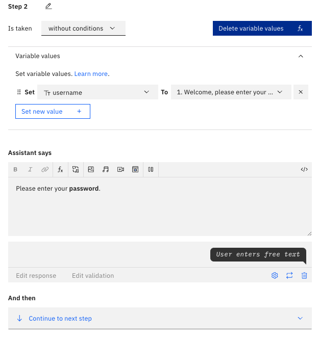

# Profile-based Access Control

**Background & challenges**: Users with unique profiles should only be able to access pertinent data relevant to their profile because it is critical that data only be accessed on a need-to-know basis to maintaining the security and confidentiality of sensitive documents.

**Proposed Solution**: Implement an AI Assistant that ensures **profile-based access control** to limit content and data exposure, along with creating rules to restrict users to specific modules.

For this example, Justin will be an employee within the Compliance department and Emma will be from the Internal Audit department. Therefore, Justin should not have access to private Internal Audit Standards information.

---

## Upload the an Internal Audit Standards document to Watson Discovery

1. Make sure that you have an Internal Audit Standards document downloaded locally.
2. Under your previous project, create a new collection.
3. Upload the file which will serve as the knowledge base. It should look like the following once you have uploaded -
   

---

## Create Login Action

1. In the watsonx Assistant platform, in the Actions tab, under Variables, under Created by you, create 3 new variables:
   - **username**: Create a new variable called username as type "Free Text" with no initial value. Then, click Save.
   - **password**: Create a new variable called password as type "Free Text" with no initial value. Then, click Save.
   - **profile**: Create a new variable called profile as type "Free Text" with no initial value. Then, click Save.
2. Under Actions, under All items, under Set by assistant, click on Greet Customer. Before anything, the user should be prompted to login to the system.
3. In the Greet Customer Action, delete all of the existing steps. Then, add on the following steps:
   1. **Step 1:** Type in "Welcome, please enter your **username**." under Assistant says, then set the output to _free text_.
   2. **Step 2:** Type in "Please enter your **password.**" under Assistant says, then set the output to _free text_. Also, set the variable value _username_ to Action step variable / Step 1. It should look similar to the following image:
      
   3. **Step 3:** Set the variable value _password_ to Action step variable / Step 2.
   4. **Step 4 and 5:** Type in "Welcome _username_, how can I assist you today?" under Assistant says. Using your preferred way of User Authentication, set the conditions as such and then set loggedIn to True.
      
   5. **Step 6:** Type in "Your username or password is incorrect, please **try again.**" under Assistant says, and set the And then section to Re-ask previous step(s) and set to Steps 1-5. Set the conditions to match your preferred authentication approach once again.
      
   6. **Step 7:** Set the And then section to Go to subaction: goes to action "Role assignment" so that they can re-login.
4. Now, when the Assistant first prompts the user, it should ask them to login.

**Test out your new action sequence in Preview!**

---

## Profile Assignment

1. Next, navigate to the Actions tab, under All items, under Created by you, create a New action called "Profile Assignment" from scratch.
2. Add your method of Authentication.
3. Be sure to save this action, then close out of this window. Preview your new action in the bottom-right Preview chat.

---

## Ensure Search Action Queries the Internal Audit Document

1. On the watsonx Assistant platform navigate to the **Search** action, on **Step 5**, create a new condition `If All of this is true: profile matches Internal Audit` and ensure that you are using the Watson Discovery Custom Extension.
   - The condition should look like the following image:
     
   - The extension setup should be the default settings, except:
     - `collections_ids` To _the **Collection ID** of your Internal Audit Document in Watson Discovery_ as `["<collection_id>"]`
       :::info
       **Where to get Collection ID**
       - **collection_ids**: In Watson Discovery, navigate to your collection, then copy the URL of your browser once you click on your collection. Copy the code between "collections" and "activity" because this is your Collection ID.
         :::
   - Be sure to click Apply, then Save.
1. Do the same for **Step 6**, setting the condition instead to `If All of this is true: profile matches Compliance` and ensure that you are using the Watson Discovery Custom Extension.
   - The condition should look like the following image:
     
   - The extension setup should be the default settings, except:
     - `collections_ids` To _the **Collection ID** of your Open Pages User Guide in Watson Discovery_ as `["<collection_id>"]`
       :::info
       **Where to get Collection ID**
       - **collection_ids**: In Watson Discovery, navigate to your collection, then copy the URL of your browser once you click on your collection. Copy the code between "collections" and "activity" because this is your Collection ID.
         :::
   - Be sure to click Apply, then Save.
1. For **Step 7**, check if Step 5 ran successfully, meaning that the user logged in as an Admin. If Step 5 ran successfully, then set the following variable values:
   - discovery_document_id To `<Step 5>body.results[0].document_id`
   - discovery_collection_id To `<Step 5>body.results[0].result_metadata`
     
1. For **Step 8**, similar to the previous step, but this time check if Step 6 ran successfully, meaning that the user logged in as an Analyst. If Step 6 ran successfully, then set the following variable values:
   - discovery_document_id To `<Step 6>body.results[0].document_id`
   - discovery_collection_id To `<Step 6>body.results[0].result_metadata`
     
1. For **Step 9**, check if Step 5 failed. If it did, then respond in the _Assistant Says_ section with "Sorry, the search failed!"
1. For **Step 10**, check if Step 5 was successful, and if it was, then set the `search results To <Step 5>.body.results`. Then, it goes to subaction Generate Answer. Please repeat this for **Step 11**, but replace all instances of Step 5 with Step 6.
   
1. For **Step 12**, check if Step 5 was successful, and if it was, then set the `search_results To <Step 5>.body.results=[]` in order to ensure, the body from the generated answer is entirely saved. Do the same for **Step 13** but for Step 6 not Step 5.
   
1. You are done!

Test out this way of managing user access by asking the Assistant Internal Audit specific questions, such as:

- "What are the requirements of Legal and Ethical Behavior for internal auditors?"

Notice the difference when a Compliance vs Internal Audit employee asks the question.
