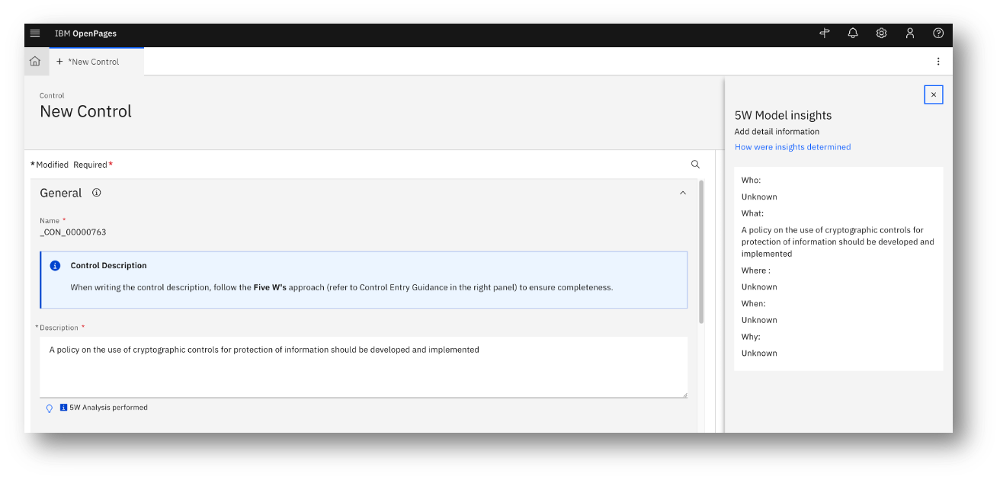
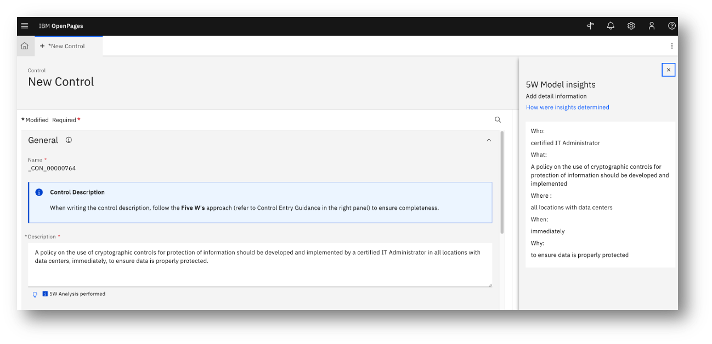

# AI-Assisted Review for Data Quality​

**Background & challenges**: OpenPages users face challenges when ensuring their text input follows internal guidelines and policies when creating new data objects, which can lead to errors and inconsistencies.

**Proposed Solution**: Implement an AI solution that reviews user input and provides feedback on whether the text input meets requirements of internal guidelines and policies.

---

### Example Screenshots:

- Incomplete Description
  
- Updated complete Description
  
