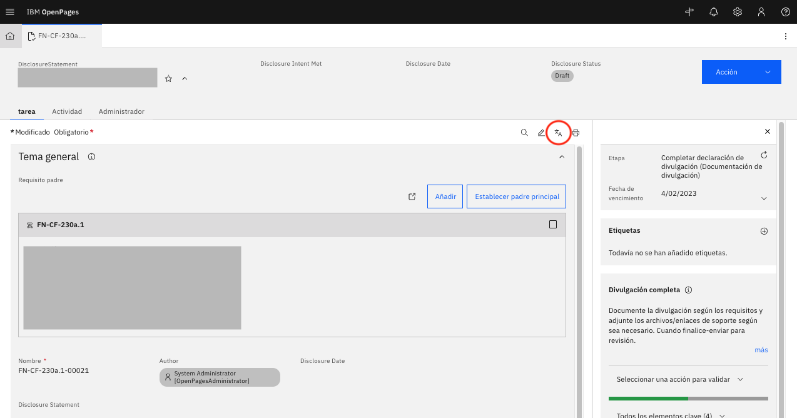

# Translation Support for User-Inputted Content

**Background & challenges**: Non-English-speaking users face language barriers to relevant OpenPages data objects, which presents risks and impacts user productivity

**Proposed Solution**: Implement an AI solution that translates OpenPages content into the user's preferred language to **enable translation on the OpenPages platform** for users to be able to view any Risk, Task, Event or more comfortably. This is easily achievable on OpenPages via several methods, but the NeuralSeek options will be showcased below. Please reach out to IBM for further methods of Translation.

_Note: Translation on OpenPages is only available on the 9.0.0.2 version._

---

## NeuralSeek Portion

1. Ensure that you have access to a NeuralSeek account and set up your account.
2. On the NeuralSeek homepage, navigate to the **Integrate** tab, then the API tab.
   
3. Take note of the **Computed URL** and **API Key** because you will need them once you go back onto the OpenPages platform.

---

## OpenPages Portion

1. On the OpenPages platform (ensure that you have the 9.0.0.2 version), navigate to the **Open Administration Menu**, then go to the **Integrations** tab, then click on **OpenPages Translation Services**.
2. On the OpenPages Translation Services settings page, ensure the following settings:
   - Translator Type: **NeuralSeek**
   - Service URL: paste in the **Computed URL** found on NeuralSeek
   - API Key: paste in the **API Key** found on NeuralSeek
   - Confidence Threshold: 75
   - Enable all Object Types: Checked
3. Click on **Test Connection** to ensure the connection is valid.
4. To test out if your translation services are working, change the locale of your OpenPages via the **Open User Menu**, then click **Change Profile** to your preferred language.
5. Next, click on a Task, Risk, Event, or other user-inputted item, and search for the **Translate button** that looks like the below image. Click it and you should see your page translate.
   
